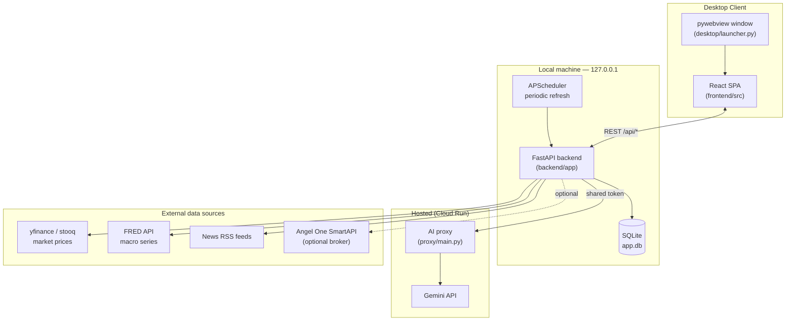
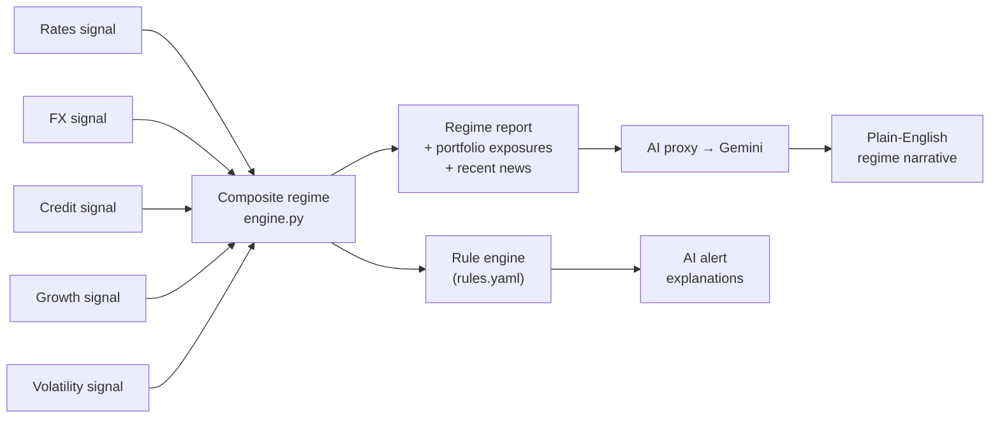

# MACRONI

**A macro-aware portfolio dashboard for Windows.** MACRONI pulls live market data, macroeconomic indicators, and news, turns them into a composite "market regime" signal, and layers AI-generated narratives, trade guidance, and alerts on top of your actual portfolio and watchlist — all in a self-updating desktop app.


---

## What it does

MACRONI is a personal "macro cockpit": instead of tracking rates, credit spreads, FX and volatility across a dozen tabs, it computes a single composite **market regime** from those signals, explains it in plain English via an LLM, and connects it back to your actual holdings.

| Area | What it gives you |
| --- | --- |
| **Regime engine** | Composite signal from rates, FX, credit, growth, and volatility sub-signals, with history |
| **Portfolio** | CSV import or manual entry, live quotes, sector/asset exposures, technicals |
| **Watchlist** | Track tickers you don't hold yet, with the same trade-guidance pipeline |
| **Alerts** | Rule-based engine (`rules.yaml`) with AI-generated plain-English explanations |
| **AI chat & tips** | Ask questions about your portfolio/regime; get diversification/risk/cost tips |
| **Trade guidance** | Technical-signal-driven buy/hold/trim guidance per position |
| **Global markets** | Market-hours clock and regional signal breakdowns across exchanges |
| **News** | Aggregated financial/central-bank RSS feeds |
| **Broker sync (optional)** | Read-only Angel One (SmartAPI) integration to pull real holdings |
| **Auto-update** | In-app one-click update via GitHub Releases + Inno Setup installer |

## Architecture

MACRONI runs the same FastAPI backend in two shapes: as a bundled desktop app (PyInstaller + `pywebview`, single `.exe`), or as a plain local web app during development (Vite dev server + `uvicorn`, no packaging).



The AI proxy is the one piece that isn't local: it holds the real Gemini key server-side (behind an app-identifying shared token, not a billable credential) so every installed copy gets AI narratives, chat, tips, and alert explanations without needing its own API key.

## Signal → regime → narrative pipeline



## Tech stack

- **Backend** — Python, FastAPI, SQLAlchemy + SQLite, APScheduler, pandas/numpy/statsmodels, yfinance, FRED API, feedparser
- **Frontend** — React 19, TypeScript, Vite, React Router, Recharts, Firebase (auth)
- **Desktop packaging** — `pywebview` (WebView2), PyInstaller, Inno Setup
- **AI proxy** — FastAPI on Cloud Run, `google-genai` (Gemini)

## Project structure

```text
macroni/
├── backend/              FastAPI app: signals, portfolio, alerts, AI, broker, markets
│   └── app/
│       ├── signals/       rates / fx / credit / growth / volatility → composite engine
│       ├── markets/       constituents, hours, regional signals
│       ├── portfolio/     holdings, exposures, technicals, CSV import
│       ├── alerts/        rule engine + AI explanations
│       ├── ai/            Gemini proxy client + NL interpreter
│       ├── broker/        Angel One SmartAPI (optional)
│       ├── data_sources/  yfinance, stooq, FRED, news RSS
│       └── api/routers/   REST endpoints
├── frontend/              React + TypeScript SPA (Vite)
│   └── src/pages/          Dashboard, Portfolio, Watchlist, Broker, Markets, Chat, Alerts, News, Account
├── desktop/               PyInstaller build spec, Inno Setup installer, pywebview launcher
├── proxy/                 Hosted Cloud Run proxy holding the real Gemini key
└── VERSION                single source of truth for the app version
```

## Running it in development

You need Python 3.11+ and Node 18+.

### Quick start

```bash
python scripts/dev.py
```

Or on Windows, double-click **`Run Dev.bat`**. This one command:

- Creates `backend/venv` and runs `npm install` the first time, so a fresh clone just works
- Starts the backend, waits for it to answer `/api/status`, then starts the frontend
- If port 8001 (the backend's default) is already taken by something else, picks the next free port instead of failing, and points the frontend at it automatically via an untracked `frontend/.env.development.local` override — `frontend/.env.development` itself is never touched
- Vite falls back to another port on its own if 5173 is taken too
- On Ctrl+C, or if either process dies on its own, stops both — no orphaned process left holding the port next time

### Manual setup

If you'd rather run each piece yourself (e.g. to see backend/frontend logs in separate terminals):

#### 1. Backend

```bash
cd backend
python -m venv venv
./venv/Scripts/activate        # Windows
pip install -r requirements.txt
uvicorn app.main:app --host 127.0.0.1 --port 8001 --reload
```

#### 2. Frontend (separate terminal)

```bash
cd frontend
npm install
npm run dev
```

Open **[http://localhost:5173](http://localhost:5173)** — `frontend/.env.development` already points the SPA at `http://127.0.0.1:8001`.

#### 3. Config (optional)

Copy `.env.example` to `.env` at the project root and set `FRED_API_KEY` (free, from [fred.stlouisfed.org](https://fred.stlouisfed.org/docs/api/api_key.html)) to enable macro series (CPI, GDP, yields). AI features (regime narratives, chat, tips) work out of the box with no key, via the hosted proxy. Angel One broker sync is also optional and configured the same way.

## Building the packaged desktop app

```bash
cd frontend && npm run build              # produces frontend/dist
pyinstaller desktop/build.spec --noconfirm   # from project root
ISCC.exe desktop/installer.iss /DMyAppVersion=<version>
```

This produces a single-window `MACRONI.exe` (FastAPI backend + React frontend + pywebview shell) and an Inno Setup installer that supports in-app auto-update via GitHub Releases.

## Tests

```bash
cd backend
pytest
```

## License

Not currently licensed for redistribution — ask the maintainer before reuse.
